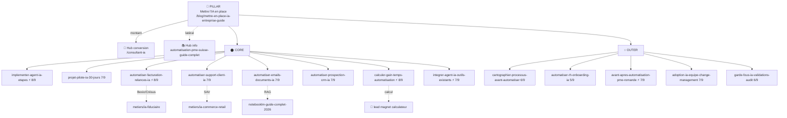

# Topical Map : Mettre l'IA en place dans son entreprise

> Généré le 2026-07-02 (via `/seo-topical-map`, mode `map`, SERP-informé). Cluster **Layer 1** de 14 entrées : 1 pillar + 13 satellites. 0 existant, 14 à créer.
> Marché : Suisse romande, dirigeants TPE/PME (1–15 pers.). Source de vérité contenu : ce fichier.
> Cluster parent : `docs/topical-map-consultant-ia.md` (couche conversion). Tracking exécution : `docs/plan-mise-en-place-ia.md`. Roadmap globale : `docs/planSEOIA.md`.

## Positionnement — la couche « COMMENT » (silo frère du cluster Consultant IA)

Ce cluster est un **silo frère** rattaché à la marque, PAS un spoke du cluster `consultant-ia`. Il couvre le **« comment mettre en place »** (méthode, processus, gain de temps mesuré, adoption) là où l'existant couvre déjà **quoi / pourquoi / combien**. Il est **transversal par fonction** (facturation, support, RH…), complémentaire aux pages `metiers/ia-*` qui sont **verticales par secteur**.

### ⚠️ Constat SERP décisif — le mur français
Scan des SERP (2026-07-02) sur les 6 requêtes-clés : l'espace « mise en place / implémentation IA » est **saturé de contenu français générique** (learnperfect, sillage.ai, dwenola, francenum.gouv.fr, nerolia, bloom-ai, hub-ia, cartelis…). **Aucun acteur suisse ne ranke.** Conséquence pour CHAQUE article de ce cluster : le seul angle qui survit au fan-out FR est le **moat suisse** :
- **nLPD + CHF** (les FR parlent RGPD/€ — intraduisible pour eux)
- **Outils suisses nommés** : Bexio, Crésus, Sage 50 Suisse, Infoniqa, banques CH (rapprochement, ISO 20022)
- **Coût horaire suisse réel** (~60–120 CHF/h → le ROI est bien plus élevé qu'en France, argument fort)
- **Preuves first-party** : audit 50 sites romands, cas clients réels, captures maison (flag ⚡ information-gain)

> Règle du cluster : un article sans ancrage suisse ni donnée first-hand = invisible face au mur FR. Ne jamais publier une redite générique.

### Note de reprise (nettoyage du parent)
`rag-documents-pme` et `chatbot-vs-agent-ia-support` (prévus P3 dans `topical-map-consultant-ia.md`, jamais briefés) sont **absorbés ici** (#6 et #5). → À retirer du parent.

---

## Hiérarchie thématique

### Pillar : Mettre l'IA en place dans son entreprise — /blog/mettre-en-place-ia-entreprise-guide *(À créer)* ⚡
Keyword : mettre en place l'IA en entreprise / implémenter l'IA dans une PME | Intent : Informationnel + commercial doux | `page_type: pillar` → `src/content/pages/`
Rôle : hub « HOW ». Maillage descendant vers les 13 spokes + montant vers `/consultant-ia` (conversion) et latéral vers `automatisation-pme-suisse-guide-complet` (hub info parent).

#### Cluster H — Méthode & mise en place — **Core**
- `implementer-agent-ia-etapes` — Déployer un agent IA : la feuille de route semaine par semaine ⚡ **À créer**
- `projet-pilote-ia-30-jours` — Projet pilote IA : prouver le ROI sur un cas en 30 jours **À créer**
- `cartographier-processus-avant-automatiser` — Cartographier ses processus avant d'automatiser **À créer** *(Outer)*

#### Cluster I — Processus transversaux (par fonction) — **Core**
- `automatiser-facturation-relances-ia` — Automatiser facturation et relances (Bexio/Crésus) ⚡ **À créer**
- `automatiser-support-client-ia` — Automatiser le support client (absorbe chatbot-vs-agent) **À créer**
- `automatiser-emails-documents-ia` — Trier emails et documents avec l'IA (absorbe RAG) **À créer**
- `automatiser-prospection-crm-ia` — Automatiser la prospection et le suivi CRM **À créer**
- `automatiser-rh-onboarding-ia` — Automatiser RH, onboarding et contrats **À créer** *(Outer)*

#### Cluster J — Gain de temps & ROI mesuré — **Core/Outer**
- `calculer-gain-temps-automatisation` — Calculer le gain de temps réel (formule + coût horaire CH) ⚡ **À créer** *(porte le lead magnet pilote)*
- `avant-apres-automatisation-pme-romande` — Avant/après : ce qu'une PME romande récupère vraiment ⚡ **À créer** *(Outer, preuve E-E-A-T)*

#### Cluster K — Adoption & gouvernance — **Outer**
- `adoption-ia-equipe-change-management` — Faire adopter l'IA à son équipe sans résistance **À créer**
- `garde-fous-ia-validations-audit` — Garde-fous IA : validations, escalades, hallucinations **À créer**
- `integrer-agent-ia-outils-existants` — Intégrer un agent IA à ses outils (CRM, ERP, n8n, MCP) ⚡ **À créer**

---

## Carte visuelle (Mermaid)

> Diagramme = visuel de lecture. Pour approfondir un spoke dense → commande `--mode deepen` dans son mini-brief.

---

## Couverture fan-out

Central Entity : « mettre en place l'IA dans une PME (Suisse romande) ». Les 4 axes et leurs spokes :

- **Reformulation** (implémenter / déployer / intégrer l'IA) : `pillar`, `implementer-agent-ia-etapes`
- **Décomposition** (par où commencer, quelles étapes, quel processus, quel budget-temps) : `cartographier-processus`, cluster I (facturation, support, emails, prospection, rh), `calculer-gain-temps`
- **Comparaison** (chatbot vs agent, no-code vs sur-mesure, interne vs prestataire, MCP vs API) : `automatiser-support-client-ia` (chatbot vs agent), `integrer-agent-ia-outils-existants` (MCP vs API) — **complété par l'existant** `workflows-vs-agents-ia-pme`
- **Implication / suite** (former les équipes, mesurer le ROI, rester conforme, fiabiliser) : `adoption-ia-equipe`, `garde-fous-ia`, `avant-apres` (+ existant `ia-nlpd-conformite-suisse`)
- **Trous détectés** : axe **Comparaison** un peu léger en propre (surtout porté par l'existant). Acceptable — ne pas forcer un comparatif redondant. À surveiller au `/seo-gsc` : si des requêtes comparatives émergent, `deepen` sur le support ou l'intégration.

---

## Tableau de production

Trié par score décroissant. Produire dans cet ordre (après le pillar, qui vient toujours en premier comme hub).

| # | Article | Sec. | Statut | Brand | Bus./Compl. | Trafic | Score | ⚡ | Module | Slug |
|---|---|---|---|---|---|---|---|---|---|---|
| — | **Mettre l'IA en place (PILLAR)** | — | À créer | 3 | 2 | 3 | 8 | ⚡ | Pillar | `mettre-en-place-ia-entreprise-guide` |
| 1 | Feuille de route déploiement agent IA | Core | À créer | 3 | 3 | 2 | 8 | ⚡ | A | `implementer-agent-ia-etapes` |
| 2 | Automatiser facturation & relances | Core | À créer | 3 | 3 | 2 | 8 | ⚡ | B | `automatiser-facturation-relances-ia` |
| 3 | Calculer le gain de temps réel | Core | À créer | 3 | 2 | 3 | 8 | ⚡ | A | `calculer-gain-temps-automatisation` |
| 4 | Projet pilote IA en 30 jours | Core | À créer | 3 | 3 | 1 | 7 | | A | `projet-pilote-ia-30-jours` |
| 5 | Automatiser le support client | Core | À créer | 2 | 3 | 2 | 7 | | B | `automatiser-support-client-ia` |
| 6 | Trier emails & documents (RAG) | Core | À créer | 2 | 2 | 3 | 7 | | B | `automatiser-emails-documents-ia` |
| 7 | Automatiser prospection & CRM | Core | À créer | 2 | 3 | 2 | 7 | | B | `automatiser-prospection-crm-ia` |
| 8 | Intégrer un agent IA à ses outils | Core | À créer | 2 | 3 | 2 | 7 | ⚡ | E | `integrer-agent-ia-outils-existants` |
| 9 | Adoption IA sans résistance | Outer | À créer | 3 | 2 | 2 | 7 | | C | `adoption-ia-equipe-change-management` |
| 10 | Avant/après PME romande | Outer | À créer | 3 | 2 | 2 | 7 | ⚡ | C | `avant-apres-automatisation-pme-romande` |
| 11 | Cartographier ses processus | Outer | À créer | 2 | 2 | 2 | 6 | | A | `cartographier-processus-avant-automatiser` |
| 12 | Garde-fous IA (fiabilité) | Outer | À créer | 3 | 1 | 2 | 6 | | A | `garde-fous-ia-validations-audit` |
| 13 | Automatiser RH & onboarding | Outer | À créer | 2 | 1 | 2 | 5 | | B | `automatiser-rh-onboarding-ia` |

Modules : A = guide pratique « comment » · B = processus/cas d'usage fonctionnel · C = persona/preuve terrain · E = comparatif/best-of.

---

## Intent Layering

- **Informationnel** : ~50 % (pillar, cartographier, calculer, avant-apres, adoption, garde-fous, rh)
- **Commercial** : ~50 % (implementer, pilote, facturation, support, emails, prospection, integrer)
- **Transactionnel** : 0 % dans ce cluster
- **Analyse** : cluster **commercial-heavy** vs l'idéal 60-70 % info. C'est **assumé** : la couche transactionnelle vit dans le cluster parent (`/consultant-ia` + pages services). ⚠️ Garde-fou GEO : les 99,9 % de citations AI Overviews portent sur l'informationnel — donc rédiger les articles « automatiser X » en **vrai how-to dense** (étapes, chiffres, outils suisses nommés), pas en argumentaire commercial déguisé, sinon zéro citation IA. Les articles Outer (calculer, avant-apres, adoption, garde-fous) sont les aimants à citations : soigner leur densité factuelle.

---

## Blueprint de maillage interne

| Article | Liens sortants obligatoires | Liens sortants recommandés | Liens entrants attendus |
|---|---|---|---|
| `mettre-en-place-ia-entreprise-guide` (pillar) | `/consultant-ia` (montant) | **tous les 13 spokes** + `automatisation-pme-suisse-guide-complet` | tous les spokes du cluster |
| `implementer-agent-ia-etapes` | pillar | `projet-pilote-ia-30-jours`, `calculer-gain-temps`, `/consultant-ia` | pillar, pilote |
| `projet-pilote-ia-30-jours` | pillar | `implementer-agent-ia-etapes`, `calculer-gain-temps` | pillar |
| `cartographier-processus-avant-automatiser` | pillar | `comment-choisir-quoi-automatiser-pme` (existant), cluster I | pillar |
| `automatiser-facturation-relances-ia` | pillar | `metiers/ia-fiduciaire`, `calculer-gain-temps` | pillar |
| `automatiser-support-client-ia` | pillar | `metiers/ia-commerce-retail`, `workflows-vs-agents-ia-pme` (existant) | pillar |
| `automatiser-emails-documents-ia` | pillar | `notebooklm-guide-complet-2026` (existant) | pillar |
| `automatiser-prospection-crm-ia` | pillar | `metiers/ia-agence-immobiliere`, `integrer-agent-ia-outils-existants` | pillar |
| `automatiser-rh-onboarding-ia` | pillar | `metiers/ia-cabinet` | pillar |
| `calculer-gain-temps-automatisation` | pillar | `avant-apres`, `prix-agent-ia-automatisation-suisse` (existant) | pillar, cluster I |
| `avant-apres-automatisation-pme-romande` | pillar | `/hermes`, `/openclaw`, `temps-perdu-pme-automatisation` (existant) | pillar |
| `adoption-ia-equipe-change-management` | pillar | `services/formation-ia-equipe`, `garde-fous-ia` | pillar |
| `garde-fous-ia-validations-audit` | pillar | `ia-nlpd-conformite-suisse` (existant), `adoption-ia-equipe` | pillar |
| `integrer-agent-ia-outils-existants` | pillar | `services/integration-outils`, `automatiser-prospection-crm-ia` | pillar |

Ancres : descriptives, variées, jamais « cliquez ici » (cf. `internal-linking.md`). Les liens latéraux ne se posent que sur intention de requête partagée (Contextual Bridges).

---

## Mini-briefs — articles à créer

### PILLAR. Mettre l'IA en place dans son entreprise : le guide méthode
- Slug : `mettre-en-place-ia-entreprise-guide`
- Slug rationale : slug court générique réservé au hub, sans date.
- Type de page : **pillar** (`src/content/pages/`)
- Keyword principal : mettre en place l'IA en entreprise / implémenter l'IA dans une PME
- Section : hub (chapeaute Core + Outer)
- Sous-requêtes fan-out couvertes : par où commencer, quelles étapes, combien de temps, quels processus, quels risques
- Module : Pillar | Intent : Informationnel + commercial doux
- Score : 8/9 (Brand 3 · Business 2 · Trafic 3) ⚡
- Angle différenciant : méthode terrain suisse (nLPD + CHF), pas un listicle FR. Hero répond « par où commencer » en 3 paragraphes, puis sectionne vers chaque spoke.
- Word count cible : 2 200–2 800 mots
- Lien sortant obligatoire : `/consultant-ia` | Recommandé : les 13 spokes + hub info
- A produire avec : `/seo-brief mettre-en-place-ia-entreprise-guide`

### 1. Déployer un agent IA : la feuille de route semaine par semaine
- Slug : `implementer-agent-ia-etapes`
- Type : article | Keyword : déployer un agent IA étapes / feuille de route déploiement IA
- Section : Core | Fan-out : quelles étapes, combien de temps, qui implique-t-on, comment généraliser
- Module : A | Intent : Commercial | Score : 8/9 (3·3·2) ⚡
- Angle : timeline concrète (S1 cadrage → S8 généralisation), gouvernance légère (référent 10-20 % temps), budget CHF. **≠ pillar** (le pillar = la carte stratégique ; ici = le calendrier opérationnel). **≠ pilote #4** (pilote = 1 cas en 30 j pour prouver ; ici = rollout org 8 sem).
- Lead magnet : ✅ feuille de route téléchargeable (FOND via futur skill — backlog)
- WC : 1 600–2 000 | Sortants : pillar, `projet-pilote-ia-30-jours`
- `/seo-brief implementer-agent-ia-etapes`
- Deepen (Layer 2) : `/seo-topical-map "déploiement agent IA" --mode deepen` si traction GSC.

### 2. Automatiser facturation et relances avec l'IA
- Slug : `automatiser-facturation-relances-ia`
- Type : article | Keyword : automatiser facturation IA / automatiser relances clients IA
- Section : Core | Fan-out : quels outils, combien de temps gagné, comment relancer sans froisser, quel ROI
- Module : B | Intent : Commercial | Score : 8/9 (3·3·2) ⚡
- Angle : **outils suisses** (Bexio, Crésus, Sage 50 CH, ISO 20022, rapprochement bancaire CH), DSO, ton des relances J+5/J+15/J+30. Donnée first-hand : setup client réel si dispo. Absorbe une partie de l'intent « agent IA compta ».
- WC : 1 400–1 800 | Sortants : pillar, `metiers/ia-fiduciaire`, `calculer-gain-temps`
- `/seo-brief automatiser-facturation-relances-ia`

### 3. Calculer le gain de temps réel d'une automatisation
- Slug : `calculer-gain-temps-automatisation`
- Type : article | Keyword : calculer ROI automatisation / gain de temps automatisation
- Section : Core | Fan-out : quelle formule, quels coûts compter, hard vs soft ROI, exemple chiffré
- Module : A | Intent : Informationnel | Score : 8/9 (3·2·3) ⚡
- Angle : formule ROI = (gains−coût)/coût, réduction réaliste 70-85 % (pas 100 %), **coût horaire suisse** (60-120 CHF/h → ROI supérieur au benchmark FR). Beaucoup de FR ont déjà un calculateur → différenciant = chiffres suisses + honnêteté sur le « soft ROI ».
- Lead magnet : ✅ **PILOTE** — calculateur (calcul libre en ligne + rapport CHF par email). FOND via futur skill (backlog).
- WC : 1 300–1 700 | Sortants : pillar, `avant-apres`, `prix-agent-ia-automatisation-suisse`
- `/seo-brief calculer-gain-temps-automatisation`

### 4. Projet pilote IA : prouver le ROI sur un cas en 30 jours
- Slug : `projet-pilote-ia-30-jours`
- Type : article | Keyword : projet pilote IA / POC IA PME
- Section : Core | Fan-out : comment choisir le cas, quels KPI, comment cadrer, quand généraliser
- Module : A | Intent : Commercial | Score : 7/9 (3·3·1)
- Angle : **dirigeant non-tech, sans DSI** (le vrai profil romand) — les FR (hub-ia, keerok) visent la DSI. Rappeler que 70 % des POC ne passent jamais en prod → méthode anti-échec (objectif clair, données réelles).
- Lead magnet : ✅ canevas de pilote (backlog)
- WC : 1 400–1 800 | Sortants : pillar, `implementer-agent-ia-etapes`, `calculer-gain-temps`
- `/seo-brief projet-pilote-ia-30-jours`

### 5. Automatiser le support client avec un agent IA
- Slug : `automatiser-support-client-ia`
- Type : article | Keyword : automatiser support client IA / chatbot vs agent IA support
- Section : Core | Fan-out : chatbot vs agent, quels canaux, comment garder l'humain, quel outil
- Module : B (avec bloc comparatif) | Intent : Commercial | Score : 7/9 (2·3·2)
- Angle : **absorbe `chatbot-vs-agent-ia-support`** du parent. Distinguer chatbot scripté vs agent qui agit (rembourse, escalade). Escalade vers humain = garde-fou.
- WC : 1 400–1 800 | Sortants : pillar, `metiers/ia-commerce-retail`, `workflows-vs-agents-ia-pme`
- `/seo-brief automatiser-support-client-ia`

### 6. Trier emails et documents automatiquement avec l'IA
- Slug : `automatiser-emails-documents-ia`
- Type : article | Keyword : automatiser tri emails IA / RAG documents PME
- Section : Core | Fan-out : comment trier/router, interroger ses docs sans halluciner (RAG), quels outils, confidentialité
- Module : B | Intent : Commercial | Score : 7/9 (2·2·3)
- Angle : **absorbe `rag-documents-pme`** du parent. Lien fort vers l'article NotebookLM existant (RAG grand public) mais va plus loin (RAG sur base docs interne + garde-fou hallucination + nLPD sur données sensibles).
- WC : 1 400–1 800 | Sortants : pillar, `notebooklm-guide-complet-2026`
- `/seo-brief automatiser-emails-documents-ia`

### 7. Automatiser la prospection et le suivi CRM avec l'IA
- Slug : `automatiser-prospection-crm-ia`
- Type : article | Keyword : automatiser prospection IA / CRM IA PME
- Section : Core | Fan-out : quoi automatiser dans le CRM, enrichissement leads, relances, quels outils
- Module : B | Intent : Commercial | Score : 7/9 (2·3·2)
- Angle : cycle commercial PME romande, enrichissement + scoring + relance auto, sans spammer. Outils connectables (HubSpot, Pipedrive, + n8n).
- WC : 1 400–1 800 | Sortants : pillar, `metiers/ia-agence-immobiliere`, `integrer-agent-ia-outils-existants`
- `/seo-brief automatiser-prospection-crm-ia`

### 8. Intégrer un agent IA à ses outils existants (CRM, ERP, n8n, MCP)
- Slug : `integrer-agent-ia-outils-existants`
- Type : article | Keyword : intégrer agent IA outils existants / connecter IA CRM ERP
- Section : Core | Fan-out : comment connecter, API vs MCP vs no-code, sécurité des données, combien ça coûte
- Module : E | Intent : Commercial | Score : 7/9 (2·3·2) ⚡
- Angle : **expertise réelle Jon (Make/Zapier/n8n/API)** = E-E-A-T. Comparatif no-code (n8n/Make) vs MCP vs dev API. Rappeler « 95 % des projets IA échouent sur l'intégration au SI ». Coûts CHF.
- WC : 1 500–1 900 | Sortants : pillar, `services/integration-outils`
- `/seo-brief integrer-agent-ia-outils-existants`

### 9. Faire adopter l'IA à son équipe sans résistance
- Slug : `adoption-ia-equipe-change-management`
- Type : article | Keyword : adoption IA équipe / conduite du changement IA PME
- Section : Outer | Fan-out : pourquoi ça résiste, comment embarquer, quelle formation, comment mesurer l'adoption
- Module : C | Intent : Informationnel | Score : 7/9 (3·2·2)
- Angle : « 70 % des projets IA échouent sur l'adoption, pas la tech » ; avantage PME = proximité dirigeant/équipe ; champions internes (pair 3× plus convaincant). Lien vers service Formation IA.
- Lead magnet : ✅ kit de lancement interne (backlog)
- WC : 1 400–1 800 | Sortants : pillar, `services/formation-ia-equipe`, `garde-fous-ia`
- `/seo-brief adoption-ia-equipe-change-management`

### 10. Avant/après : ce qu'une PME romande récupère vraiment
- Slug : `avant-apres-automatisation-pme-romande`
- Type : article | Keyword : exemple automatisation PME / cas concret gain de temps IA
- Section : Outer | Fan-out : combien d'heures gagnées, sur quelles tâches, en combien de temps, à quel coût
- Module : C | Intent : Informationnel | Score : 7/9 (3·2·2) ⚡
- Angle : **preuve first-party pure** — cas client romand réel (anonymisé si besoin), tableaux avant/après en heures et CHF. Aimant à citations IA. S'appuie sur le constat « 654 h/an » de l'article existant.
- WC : 1 300–1 700 | Sortants : pillar, `/hermes`, `temps-perdu-pme-automatisation`
- `/seo-brief avant-apres-automatisation-pme-romande`

### 11. Cartographier ses processus avant d'automatiser
- Slug : `cartographier-processus-avant-automatiser`
- Type : article | Keyword : cartographier processus avant automatisation / mapping processus PME
- Section : Outer | Fan-out : comment lister ses processus, lesquels sont automatisables, comment les documenter, quoi mesurer
- Module : A | Intent : Informationnel | Score : 6/9 (2·2·2)
- Angle : **méthode de cartographie** (dessiner ses flux : volume, répétitivité, risque, satisfaction). ⚠️ **≠ `comment-choisir-quoi-automatiser-pme`** (existant = grille de priorisation/ROI). Ici = l'étape amont (cartographier), qui **linke vers** la priorisation comme étape suivante.
- Lead magnet : ✅ grille de cartographie (backlog)
- WC : 1 300–1 600 | Sortants : pillar, `comment-choisir-quoi-automatiser-pme`
- `/seo-brief cartographier-processus-avant-automatiser`

### 12. Garde-fous IA : validations, escalades, audit des décisions
- Slug : `garde-fous-ia-validations-audit`
- Type : article | Keyword : garde-fous IA / fiabilité agent IA / éviter hallucinations entreprise
- Section : Outer | Fan-out : comment éviter les erreurs, human-in-the-loop, tracer les décisions, quand ne pas laisser l'IA seule
- Module : A | Intent : Informationnel + Trust | Score : 6/9 (3·1·2)
- Angle : opérationnel (≠ `ia-nlpd-conformite-suisse` qui est légal). Validations en cascade, seuils de confiance, escalade humaine, journal d'audit. Trust-builder.
- WC : 1 300–1 600 | Sortants : pillar, `ia-nlpd-conformite-suisse`
- `/seo-brief garde-fous-ia-validations-audit`

### 13. Automatiser RH, onboarding et contrats avec l'IA
- Slug : `automatiser-rh-onboarding-ia`
- Type : article | Keyword : automatiser RH IA PME / automatiser onboarding IA
- Section : Outer | Fan-out : quoi automatiser en RH, onboarding, contrats/attestations, données sensibles
- Module : B | Intent : Informationnel | Score : 5/9 (2·1·2)
- Angle : processus RH d'une petite structure (pas de SIRH), génération contrats/attestations, onboarding ; **nLPD sur données RH** = garde-fou obligatoire. Volume plus faible → Outer, à produire en fin de cluster.
- WC : 1 200–1 500 | Sortants : pillar, `metiers/ia-cabinet`
- `/seo-brief automatiser-rh-onboarding-ia`

---

## Cannibalisation détectée

| Paire | Risque | Résolution |
|---|---|---|
| Pillar `mettre-en-place-ia-entreprise-guide` vs hub `automatisation-pme-suisse-guide-complet` | Moyen — deux hubs proches | Primary KW distincts (« mettre en place l'IA » vs « automatisation PME suisse ») + intents distincts (méthode/how vs panorama what/why). Le pillar **linke vers** le hub et reste focalisé « comment ». OK si discipline maintenue. |
| `cartographier-processus` (#11) vs `comment-choisir-quoi-automatiser-pme` (existant) | Moyen | Hiérarchiser : #11 = **méthode de cartographie** (amont) → linke vers l'existant = **grille de priorisation** (aval). Un seul primary KW chacun. |
| `implementer-agent-ia-etapes` (#1) vs `projet-pilote-ia-30-jours` (#4) vs pillar | Faible | Pillar = carte stratégique ; #1 = rollout org 8 semaines ; #4 = 1 POC en 30 j pour prouver. Titles franchement différents → OK. |
| `automatiser-support-client-ia` (#5) absorbe `chatbot-vs-agent-ia-support` (parent) | — | Retirer l'entrée du parent. |
| `automatiser-emails-documents-ia` (#6) absorbe `rag-documents-pme` (parent) | — | Retirer l'entrée du parent. |
| `integrer-agent-ia-outils-existants` (#8) vs page `services/integration-outils` | Faible | Article how-to vs page service (offre). Se lient, ne se cannibalisent pas. |

---

## 🅿️ Lead magnets rattachés (skill en BACKLOG)

> ⚠️ Portée revue (2026-07-02) : le futur skill `/lead-magnet` s'arrêtera à produire le **FOND** (contenu brut `.md`). L'infra de livraison (collection `resources`, page `/ressources/`, capture email Web3Forms, PDF, CTA injecté, composant calculateur) est **backlog** — voir `docs/plan-mise-en-place-ia.md`. Ce tableau = cartographie *quelle ressource ↔ quel article*, pas encore actionnable.

| Article | Lead magnet | Type | Priorité |
|---|---|---|---|
| `calculer-gain-temps-automatisation` | Calculateur gain de temps → économie CHF/an + rapport par email | calculateur | **PILOTE** |
| `implementer-agent-ia-etapes` | Feuille de route 8 semaines (template) | feuille-de-route | P2 |
| `projet-pilote-ia-30-jours` | Canevas de projet pilote (objectifs, KPI, garde-fous) | template | P3 |
| `cartographier-processus-avant-automatiser` | Grille de cartographie de processus | template | P3 |
| `adoption-ia-equipe-change-management` | Kit de lancement interne (annonce + FAQ équipe) | mini-guide | P3 |

---

## Prochaines actions

1. Nettoyer le parent : retirer `rag-documents-pme` + `chatbot-vs-agent-ia-support` de `topical-map-consultant-ia.md`.
2. `/seo-brief mettre-en-place-ia-entreprise-guide` (pillar en premier).
3. Puis produire dans l'ordre du tableau (#1 → #13). Caler sur créneaux lun/ven libres à partir de septembre 2026 (`/calendar`).
4. Lead magnet : session dédiée pour cadrer le skill `/lead-magnet` avant de coder (backlog).
