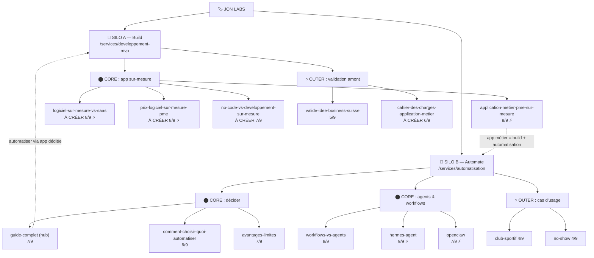

# Topical Map : C1 — Développement sur-mesure & Automatisation IA

> Généré le 2026-06-25. Cluster de 18 articles + 2 piliers service : 18 existants (les 4 spokes Build créés le 2026-06-25, commit 80f524e), 0 à créer.
> Marché : Suisse romande (PME/indépendants 30-55 ans). Source de vérité : ce fichier + `docs/restructuration-clusters.md` (section C1).
> Brand : Jon Labs (app sur-mesure + automatisation + SEO local).

## ⚠️ Décision structurante : C1 = deux silos frères, pas un cluster plat

L'analyse data le confirme : « app custom » et « automatisation/IA » ne sont **pas un même sujet** (test Koray : *l'automatisation IS-A app sur-mesure ?* → non, c'est une offre adjacente servant la même cliente). Ce sont **deux silos frères** sous l'entité Jon Labs, chacun avec son pilier service :

| Silo | Pilier service | État | Hub blog | Force actuelle |
|------|---------------|------|----------|----------------|
| **A — Build** (app/logiciel sur-mesure, MVP) | `/services/developpement-mvp` | indexée, **pos 25**, 2 liens | ❌ aucun hub blog | 🔴 **faible** — thread à étoffer |
| **B — Automate** (automatisation, agents IA) | `/services/automatisation` | **noindex** à finaliser | `automatisation-pme-suisse-guide-complet` | 🟢 **fort** — Hermès = 2e page du site (1610 imp) |

**Conséquence de production :**
- Le **Silo B est quasi-complet en Layer 1** (5 spokes forts + hub blog + pilier à dé-noindexer). Action = consolider/finaliser, pas créer. Candidat à une `--mode deepen` propre **plus tard**, quand `/seo-gsc` montrera quels spokes gagnent.
- Le **Silo A est le vrai chantier de création** : pilier faible, zéro hub blog, 1 seul vrai spoke (`application-metier-pme-sur-mesure`, programmé). Les 4 articles « À créer » de cette map ciblent ce silo.
- Cette map traite les **deux silos ensemble** (ils se maillent via le pont « application métier » et partagent l'audience), mais flague clairement ce qui relève de chacun.

---

## Hiérarchie thématique

### SILO A — Build : `/services/developpement-mvp` → à promouvoir en pilier « app sur-mesure »
Keyword pilier : *développement application / logiciel sur-mesure PME* | Intent : Transactionnel | Statut : Existant (à étoffer + élargir au-delà du seul « MVP »)

#### A1 : App / logiciel métier sur-mesure — Core
- `application-metier-pme-sur-mesure` — App métier sur mesure : 5 cas concrets · Existant (🗓️ 24.07) · pont C1↔C2 ⚡
- `logiciel-sur-mesure-vs-saas` — Logiciel sur-mesure ou abonnement SaaS · **✅ Créé** (80f524e)
- `prix-logiciel-sur-mesure-pme` — Combien coûte une application métier sur-mesure · **✅ Créé** (80f524e)
- `no-code-vs-developpement-sur-mesure` — No-code (Bubble/Webflow) ou vrai développement · **✅ Créé** (80f524e)

#### A2 : Validation amont (top-of-funnel) — Outer
- `valide-idee-business-suisse` — Valider ton idée sans créer de Sàrl · Existant
- `cahier-des-charges-application-metier` — Rédiger le cahier des charges de ton app métier · **✅ Créé** (80f524e)

### SILO B — Automate : `/services/automatisation` → à finaliser (retirer noindex)
Hub blog informationnel : `automatisation-pme-suisse-guide-complet` | Intent pilier : Transactionnel | Statut : noindex à lever

#### B1 : Décider quoi automatiser — Core
- `automatisation-pme-suisse-guide-complet` — Guide complet automatisation PME · Existant (= **hub blog du silo**)
- `comment-choisir-quoi-automatiser-pme` — Quoi automatiser en premier (méthode + ROI) · Existant 🔵 à enrichir
- `avantages-limites-automatisation-pme` — Avantages réels et coûts cachés · Existant 🟢

#### B2 : Agents IA & workflows — Core
- `workflows-vs-agents-ia-pme` — Workflow ou agent IA : lequel choisir · Existant 🟢
- `hermes-agent-ia-pme` — Hermes Agent pour PME (guide + CHF) · Existant 🟢 **#1 du cluster** ⚡
- `openclaw-pme-suisse` — OpenClaw pour PME (guide + CHF) · Existant 🟢 ⚡

#### B3 : Cas d'usage (preuve terrain) — Outer
- `automatisation-club-sportif` — Club sportif : Excel ne suffit plus · Existant (persona secondaire) — **KEEP-demote**
- `no-show-rendez-vous-2026` — No-shows : sécuriser les RDV · Existant — **KEEP-demote**

#### ⛔ À fusionner (301) — ne pas garder en l'état
- `ia-pragmatique-pme-suisse` → 301 vers le guide automatisation (thin + redondant)
- `temps-perdu-pme-automatisation` → 301 vers le guide automatisation (la stat « 654 h/an » devient le hook du guide)

---

## Carte visuelle (Mermaid)

> Le diagramme est un visuel de lecture. Pour approfondir un spoke quand il rankera, copier sa commande `--mode deepen` depuis le mini-brief.

---

## Couverture fan-out

Fan-out simulé sur le Central Entity « développement application/logiciel sur-mesure PME Suisse » + « automatisation PME Suisse ».

- **Reformulation** : `application-metier-pme-sur-mesure`, `logiciel-sur-mesure-vs-saas` (build) · `automatisation-pme-suisse-guide-complet` (automate)
- **Décomposition** : `cahier-des-charges-application-metier`, `prix-logiciel-sur-mesure-pme` (build) · `comment-choisir-quoi-automatiser-pme` (automate)
- **Comparaison** : `no-code-vs-developpement-sur-mesure`, `logiciel-sur-mesure-vs-saas` (build) · `workflows-vs-agents-ia-pme`, `hermes-agent-ia-pme` vs `openclaw-pme-suisse` (automate)
- **Implication** : `valide-idee-business-suisse` (amont) · `avantages-limites-automatisation-pme` (coûts cachés / suite)
- **Trous détectés** : côté **build**, l'axe Comparaison et Prix étaient vides avant cette map (→ les 3 spokes A1 à créer les comblent). Côté **automate**, les 4 axes sont couverts → silo complet.

---

## Tableau de production

Trié par score décroissant. Les « À créer » d'abord (priorité = combler le Silo A faible). `Bus./Compl.` = Business pour Core, Complétude pour Outer.

| # | Article | Silo/Sec. | Statut | Brand | Bus./Compl. | Trafic | Score | ⚡ | Module | Slug |
|---|---|---|---|---|---|---|---|---|---|---|
| 1 | Logiciel sur-mesure ou SaaS | A·Core | **À créer** | 3 | 3 | 2 | 8 | ⚡ | E | logiciel-sur-mesure-vs-saas |
| 2 | Prix application métier sur-mesure | A·Core | **À créer** | 3 | 3 | 2 | 8 | ⚡ | C | prix-logiciel-sur-mesure-pme |
| 3 | No-code ou développement sur-mesure | A·Core | **À créer** | 3 | 2 | 2 | 7 | | E | no-code-vs-developpement-sur-mesure |
| 4 | Cahier des charges app métier | A·Outer | **À créer** | 3 | 1 | 2 | 6 | | D | cahier-des-charges-application-metier |
| — | App métier sur-mesure : 5 cas | A·Core | Existant 🗓️ | 3 | 3 | 2 | 8 | ⚡ | B | application-metier-pme-sur-mesure |
| — | Hermes Agent PME | B·Core | Existant 🟢 | 3 | 3 | 3 | 9 | ⚡ | — | hermes-agent-ia-pme |
| — | Workflow ou agent IA | B·Core | Existant 🟢 | 3 | 3 | 2 | 8 | | E | workflows-vs-agents-ia-pme |
| — | Guide automatisation PME (hub) | B·Core | Existant | 3 | 2 | 2 | 7 | | — | automatisation-pme-suisse-guide-complet |
| — | Avantages/limites automatisation | B·Core | Existant 🟢 | 3 | 2 | 2 | 7 | | — | avantages-limites-automatisation-pme |
| — | OpenClaw PME | B·Core | Existant 🟢 | 3 | 2 | 2 | 7 | ⚡ | — | openclaw-pme-suisse |
| — | Quoi automatiser en premier | B·Core | Existant 🔵 | 3 | 2 | 1 | 6 | | — | comment-choisir-quoi-automatiser-pme |
| — | Valider son idée business | A·Outer | Existant | 2 | 1 | 2 | 5 | | — | valide-idee-business-suisse |
| — | Club sportif / Excel | B·Outer | KEEP-demote | 2 | 1 | 1 | 4 | | — | automatisation-club-sportif |
| — | No-shows RDV | B·Outer | KEEP-demote | 2 | 1 | 1 | 4 | | — | no-show-rendez-vous-2026 |

> Volumes réels (DataForSEO) : marché niche FR/CH — « automatisation entreprise » 90, « agent ia autonome » 110 (longue traîne « créer un agent ia » 260-590), « automatisation n8n » 210, « applications web sur mesure » 0 confirmé (requête trop spécifique → cibler les variantes décomposées). Trafic scoré 1-2 partout : cluster d'**autorité + conversion**, pas de volume. Cohérent avec un service premium local.

---

## Intent Layering

Périmètre = 14 spokes blog (hors 2 piliers service transactionnels).
- **Informationnel** : ~64 % (9/14) — guides, méthode, cas d'usage, agents IA
- **Commercial** : ~29 % (4/14) — les 3 comparatifs/prix à créer + workflows-vs-agents
- **Transactionnel** : ~7 % (1/14, + les 2 piliers service) — valide-idee
- **Analyse** : ✅ équilibre sain. Les « À créer » ajoutent justement le commercial qui manquait au Silo A (avant : 100 % informationnel côté build). Aucun excès transactionnel → compatible citations IA (AI Overviews = 99,9 % informationnel).

---

## Blueprint de maillage interne

| Article | Liens sortants obligatoires | Liens sortants recommandés | Liens entrants attendus |
|---|---|---|---|
| `/services/developpement-mvp` (pilier A) | — | tous les spokes A1+A2, + pont vers `/services/automatisation` | tous les spokes Silo A, home, footer |
| `/services/automatisation` (pilier B) | — | hub guide + spokes B1/B2, + pont vers `/services/developpement-mvp` | tous les spokes Silo B, home, footer |
| `application-metier-pme-sur-mesure` | `/services/developpement-mvp` | `/services/automatisation`, `prix-logiciel-sur-mesure-pme` | pilier A, `logiciel-sur-mesure-vs-saas` |
| `logiciel-sur-mesure-vs-saas` (à créer) | `/services/developpement-mvp` | `prix-logiciel-sur-mesure-pme`, `no-code-vs-developpement-sur-mesure` | pilier A, `application-metier-pme-sur-mesure` |
| `prix-logiciel-sur-mesure-pme` (à créer) | `/services/developpement-mvp` | `logiciel-sur-mesure-vs-saas`, `application-metier-pme-sur-mesure` | pilier A, comparatifs A1 |
| `no-code-vs-developpement-sur-mesure` (à créer) | `/services/developpement-mvp` | `logiciel-sur-mesure-vs-saas` | pilier A |
| `cahier-des-charges-application-metier` (à créer) | `/services/developpement-mvp` | `valide-idee-business-suisse`, `prix-logiciel-sur-mesure-pme` | pilier A |
| `automatisation-pme-suisse-guide-complet` (hub B) | `/services/automatisation` | tous les spokes B1/B2 | tous les spokes Silo B |
| Spokes B (hermes, openclaw, workflows…) | hub guide + `/services/automatisation` | siblings B pertinents | hub, pilier B |

**Ponts inter-silos (Contextual Bridges, intention partagée uniquement) :** `application-metier-pme-sur-mesure` ↔ `/services/automatisation` (une app métier embarque souvent de l'automatisation) ; le guide automatisation ↔ `/services/developpement-mvp` (quand le besoin dépasse Make/n8n → app dédiée). Ne PAS sur-mailler entre silos hors de ces points.

---

## Mini-briefs — articles à créer

### 1. Logiciel sur-mesure ou abonnement SaaS : comment trancher

- Slug : `logiciel-sur-mesure-vs-saas`
- Slug rationale : comparatif tête-à-tête, requête « sur-mesure vs SaaS » explicite, sans date
- Type de page : article (spoke), Silo A
- Keyword principal : logiciel sur-mesure ou saas
- Section : Core
- Sous-requêtes fan-out couvertes : « développement sur-mesure vs logiciel du marché », « quand un SaaS ne suffit plus », « coût SaaS vs sur-mesure sur 5 ans », « inconvénients abonnement SaaS PME »
- Module : E (Best-of / comparatif structuré)
- Intent : Commercial
- Score : 8/9 (Brand 3 · Business 3 · Trafic 2) ⚡ (calcul TCO SaaS vs sur-mesure first-party en CHF)
- Word count cible : 1 600-2 000 mots
- Lien sortant obligatoire vers : `/services/developpement-mvp`
- Lien sortant recommandé vers : `prix-logiciel-sur-mesure-pme`, `no-code-vs-developpement-sur-mesure`, `application-metier-pme-sur-mesure`
- A produire avec : `/seo-brief logiciel-sur-mesure-vs-saas`
- Approfondir ce spoke (Layer 2) : `/seo-topical-map "logiciel sur-mesure vs saas" --mode deepen`

### 2. Combien coûte une application métier sur-mesure en Suisse

- Slug : `prix-logiciel-sur-mesure-pme`
- Slug rationale : intent prix explicite, miroir de `prix-application-mobile-suisse` (C2) côté web/métier
- Type de page : article (spoke), Silo A
- Keyword principal : prix application métier sur mesure suisse
- Section : Core
- Sous-requêtes fan-out couvertes : « combien coûte un logiciel sur-mesure », « tarif développement application métier », « budget app interne PME », « facteurs de prix d'un logiciel sur-mesure »
- Module : C (cas chiffrés / fourchettes)
- Intent : Commercial
- Score : 8/9 (Brand 3 · Business 3 · Trafic 2) ⚡ (fourchettes CHF réelles issues de projets livrés)
- Word count cible : 1 400-1 800 mots
- Lien sortant obligatoire vers : `/services/developpement-mvp`
- Lien sortant recommandé vers : `logiciel-sur-mesure-vs-saas`, `application-metier-pme-sur-mesure`, `/services/automatisation`
- A produire avec : `/seo-brief prix-logiciel-sur-mesure-pme`
- Approfondir ce spoke (Layer 2) : `/seo-topical-map "prix application métier sur-mesure" --mode deepen`

### 3. No-code ou développement sur-mesure : que choisir pour ta PME

- Slug : `no-code-vs-developpement-sur-mesure`
- Slug rationale : comparatif no-code vs code, capte le trafic des concurrents no-code romands (Lyketil, Bubble/Webflow)
- Type de page : article (spoke), Silo A
- Keyword principal : no code ou développement sur mesure
- Section : Core
- Sous-requêtes fan-out couvertes : « bubble vs développement sur-mesure », « limites du no-code pour PME », « quand passer du no-code au code », « no-code fiable pour une entreprise »
- Module : E (comparatif)
- Intent : Commercial
- Score : 7/9 (Brand 3 · Business 2 · Trafic 2)
- Word count cible : 1 400-1 800 mots
- Lien sortant obligatoire vers : `/services/developpement-mvp`
- Lien sortant recommandé vers : `logiciel-sur-mesure-vs-saas`
- A produire avec : `/seo-brief no-code-vs-developpement-sur-mesure`
- Approfondir ce spoke (Layer 2) : `/seo-topical-map "no-code vs sur-mesure" --mode deepen`

### 4. Rédiger le cahier des charges de ton application métier

- Slug : `cahier-des-charges-application-metier`
- Slug rationale : étape décomposition amont du projet, top-of-funnel informationnel, sans date
- Type de page : article (spoke), Silo A
- Keyword principal : cahier des charges application métier
- Section : Outer
- Sous-requêtes fan-out couvertes : « comment rédiger un cahier des charges app », « modèle cahier des charges logiciel sur-mesure », « erreurs cahier des charges », « étapes avant de développer une app »
- Module : D (guide pratique / checklist)
- Intent : Informationnel
- Score : 6/9 (Brand 3 · Complétude 1 · Trafic 2)
- Word count cible : 1 200-1 600 mots
- Lien sortant obligatoire vers : `/services/developpement-mvp`
- Lien sortant recommandé vers : `valide-idee-business-suisse`, `prix-logiciel-sur-mesure-pme`
- A produire avec : `/seo-brief cahier-des-charges-application-metier`
- Approfondir ce spoke (Layer 2) : `/seo-topical-map "cahier des charges logiciel" --mode deepen`

---

## Décisions C1 tranchées (verdicts)

> Rien n'est supprimé sans OK explicite de Jonathan. Verdicts proposés ci-dessous.

| Page | Verdict proposé | Raison |
|------|-----------------|--------|
| `/blog/valide-idee-business-suisse` | 🟢 **KEEP** — Outer spoke Silo A (validation amont) | Top-of-funnel légitime, maille vers le pilier MVP. |
| `/services/validation-idee` (noindex) | 🟣 **MERGE confirmé** (Jonathan, 2026-06-25) → section « Phase 0 : valider l'idée » du pilier `developpement-mvp` puis 301 | Page noindex + thin ; concentre l'autorité sur 1 pilier Build. Pas vendue comme offre autonome. |
| `/blog/ia-pragmatique-pme-suisse` (7 imp) | 🟣 **301 → guide automatisation** | Thin + redondant avec le guide et `comment-choisir-quoi-automatiser`. |
| `/blog/temps-perdu-pme-automatisation` (6 imp) | 🟣 **301 → guide automatisation** | Thin ; la stat « 654 h/an » devient le hook d'intro du guide. |
| `/blog/automatisation-club-sportif` (2 imp) | 🟢 **KEEP-demote** — Outer use-case, maillé au guide | Sert le **persona secondaire** (club/association) du `seo-context`. Faible coût, vraie preuve. Re-évaluer à J+90 via `/seo-gsc`. |
| `/blog/no-show-rendez-vous-2026` (4 imp) | 🟢 **KEEP-demote** — Outer use-case, maillé au guide | Scénario de conversion réel (réservation, acomptes TWINT). Re-évaluer à J+90. |

### Rationalisation des pages service (Phase 3 — pour mémoire)
De 5 pages build/automate éparpillées → 2 piliers nets :
- `/services/outils-sur-mesure` (thin, discovered-not-indexed) → 🟣 **MERGE** dans `developpement-mvp`.
- `/services/integration-outils` (noindex) → 🟣 **MERGE** dans `/services/automatisation` (c'est de l'intégration/automatisation).
- `/services/validation-idee` (noindex) → 🟣 **MERGE** dans `developpement-mvp` (cf. ci-dessus).
- `/services/automatisation` → **finaliser + retirer noindex** (pilier Silo B).
- `/services/developpement-mvp` → **élargir** « MVP » → « application/logiciel sur-mesure » + mailler tous les spokes Silo A (pilier Silo A).

---

## Cannibalisation détectée

Tests anti-cannibalisation (SERP partagé / primary unique / deux titles) passés sur les paires proches :

- **`logiciel-sur-mesure-vs-saas` vs `no-code-vs-developpement-sur-mesure`** : intentions distinctes (sur-mesure vs *produit fini SaaS* ≠ sur-mesure vs *no-code*). Primary keywords différents. ✅ Deux pages.
- **`application-metier-pme-sur-mesure` (5 cas) vs `logiciel-sur-mesure-vs-saas`** : le premier = preuve par l'exemple (use-cases), le second = arbitrage d'achat. Le « 5 cas » **mentionne et linke** le comparatif sans viser son SERP. ✅ Deux pages, panorama→comparatif hiérarchisé.
- **`prix-logiciel-sur-mesure-pme` vs `prix-application-mobile-suisse` (C2)** : intent prix partagé MAIS entités distinctes (app métier/web vs app mobile). Requêtes réellement différentes. ✅ Pas de conflit — pont inter-cluster (lien latéral) plutôt que fusion.
- **`ia-pragmatique-pme-suisse` vs guide automatisation** : ⚠️ **cannibalisation réelle** (même intention « usages IA/auto pour PME »). → Résolu par le 301 (cf. décisions).
- **`temps-perdu-pme-automatisation` vs guide automatisation** : ⚠️ redondance. → Résolu par le 301.
- **`/services/validation-idee` vs `developpement-mvp`** : intentions proches (valider≈amorcer un build). → Résolu par MERGE recommandé.

---

> **Prochain article :** « Logiciel sur-mesure ou abonnement SaaS » (Silo A, score 8/9, comble le trou Comparaison du build).
> Lance `/seo-brief logiciel-sur-mesure-vs-saas` pour démarrer. Keyword et module sont dans le mini-brief #1.
