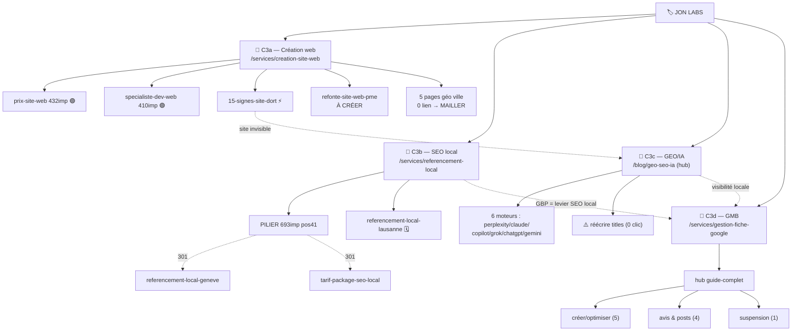

# Topical Map : C3 — Création web & Référencement

> Généré le 2026-06-25. Macro-cluster de ~35 pages réparties en **4 silos frères**. Cluster **mature** : 90 % existant.
> Marché : Suisse romande (PME/indépendants). Source de vérité : ce fichier + `docs/restructuration-clusters.md` (section C3).
> Brand : Jon Labs. **Nature du chantier C3 = AUDIT/CONSOLIDATION**, pas création (≠ C1 qui était un chantier de création côté Build).

## ⚠️ Lecture structurante : C3 = 4 silos frères, pas un cluster

Comme C1, « web + référencement » n'est pas un sujet unique mais **4 silos frères** sous l'entité Jon Labs, chacun avec son pilier. La différence avec C1 : ici les 4 silos sont **déjà nourris** (souvent les pages les plus fortes du site). Le travail dominant n'est pas Phase 1 (créer) mais **Phase 2 (consolider/dé-cannibaliser)**, **Activation** (3 piliers UNKNOWN to Google) et **Phase 4 (réécriture CTR)**.

| Silo | Pilier | État | Force | Action dominante |
|------|--------|------|-------|------------------|
| **C3a — Création/refonte web** | `/services/creation-site-web` (+ landing `/developpeur-web-freelance-geneve`) | thin (pos 3.8, crawled-not-indexed) ; landing **UNKNOWN** | spokes blog forts (prix 432 imp, spécialiste 410) | Activer le pilier + landing, mailler |
| **C3b — SEO local** | `/services/referencement-local` | indexée, 693 imp, **pos 41** | fort mais **cannibalisé** | **Consolider** (301 de 2 articles) + booster |
| **C3c — GEO / visibilité IA** | `/blog/geo-seo-ia` (hub informationnel, pas de service) | hub 160 imp + 7 spokes (perplexity 377, claude 283) | **complet** (6 moteurs couverts) | **Réécriture CTR** (rankent à 0 clic) |
| **C3d — Google My Business** | `/services/gestion-fiche-google` (transac) + `fiche-google-my-business-guide-complet-2026` (hub blog) | 12 pages, ranke | **sur-couvert** | **Élire le pilier** + organiser les 11 satellites |

> Note périmètre : les sous-landings **plateformes** (`/services/developpeur-webflow`, `/services/developpeur-wordpress`) relèvent de la feature dédiée **`docs/chantier-cluster-plateformes.md`** (EN ATTENTE) — traitées là-bas, juste activées/maillées ici.

---

## Hiérarchie thématique

### SILO C3a — Création / refonte de sites web
Pilier service : `/services/creation-site-web` (indexable, thin) · Landing perso : `/developpeur-web-freelance-geneve` (🟠 UNKNOWN to Google)

#### C3a-1 : Prix & choix prestataire — Core
- `prix-site-web-suisse-2026` — Combien coûte un site web en Suisse · 🟢 432 imp, 15 liens (top maillé)
- `specialiste-developpement-web-suisse` — Choisir un spécialiste dev web · 🟢 410 imp
- `freelance-ou-agence-web` — Freelance ou agence web · 🔵 bien maillé, faibles imp

#### C3a-2 : Diagnostic & activation du site — Core/Outer
- `15-signes-site-web-dort` — 15 signes que ton site dort (checklist) · 🟢 88 imp ⚡
- `cout-site-web-dormant-calculateur` — Calculateur site dormant · 🟢 outil 68 imp ⚡
- `visibilite-site-internet-2026` — Site web actif = vital · 🔵 IMPROVE
- `creer-site-vitrine-ia-visibilite-google` — Site vitrine IA invisible · 🟢 30 imp, 12 liens (pont C3a↔C3c)
- `refonte-site-web-pme` — Quand refondre ton site (signes + ROI) · **À créer** (feed `/services/refonte-site-web`)

#### C3a-3 : Pages géo ville — Core (à dé-orphaniser)
- `/developpement-web/{annemasse,gaillard,ville-la-grand,saint-julien,la-roche}` · 🟠 41-211 imp, **0 lien** → mailler depuis les services

### SILO C3b — Référencement local / SEO
Pilier : `/services/referencement-local` (🟢 693 imp, pos 41 — pilier d'autorité SEO local)

- `referencement-local-geneve` — 7 leviers Genève · 🟣 **MERGE** (cannibalise le pilier)
- `tarif-package-seo-local-suisse` — Tarifs SEO local CHF · 🟣 **MERGE** (cannibalise le pilier)
- `referencement-local-lausanne` — 7 leviers Lausanne · 🗓️ programmé 26.06 (geo-variant, KEEP)

### SILO C3c — GEO / visibilité sur les IA
Hub informationnel : `/blog/geo-seo-ia` (= pilier du silo, 6 moteurs comparés)

- `apparaitre-perplexity` · 🟢 377 imp ⚡ — **réécrire title/meta (0 clic)**
- `apparaitre-claude` · 🟢 283 imp — réécrire CTR
- `apparaitre-copilot` · 🟢 202 imp — réécrire CTR
- `apparaitre-grok` · 🟢 54 imp
- `apparaitre-chatgpt-geneve` · 🔵 11 imp (pont GEO↔local)
- `apparaitre-gemini` · 🔵 indexation à vérifier
- `0a30joursgooglevisible` · 🟢 34 imp (pont GEO↔local, plan d'action commerce)

### SILO C3d — Google My Business
Pilier transac : `/services/gestion-fiche-google` · **Hub blog élu** : `fiche-google-my-business-guide-complet-2026` (78 imp)

#### C3d-1 : Créer & optimiser la fiche — Core
- `creer-fiche-google-my-business-etape-par-etape` · 201 imp 🟢
- `optimiser-fiche-google-my-business-checklist-2026` · 29 imp
- `choisir-categorie-google-business-profile` · 76 imp
- `entrer-top-3-google-maps` · 98 imp 🟢
- `comment-apparaitre-google-maps-pme-debutant` · pont débutant

#### C3d-2 : Avis & animation — Core
- `obtenir-plus-avis-google` · 21 imp
- `repondre-avis-google-modeles-2026` · 95 imp 🟢
- `qr-code-avis-google-collecte-pme` · 43 imp
- `google-post-business-profile-conversion` · animation Posts

#### C3d-3 : Incidents — Outer
- `fiche-google-my-business-suspendue-recours` · recours suspension

---

## Carte visuelle (Mermaid)

---

## Couverture fan-out

Fan-out simulé sur « création site web Suisse romande » + « référencement local / visibilité Google PME ».

- **Reformulation** : `creation-site-web` / `developpeur-web-freelance-geneve` (web) · `referencement-local` (local) · `geo-seo-ia` (IA)
- **Décomposition** : `prix-site-web-suisse-2026`, pages géo ville (web) · les 5 spokes GMB « créer/optimiser » (GMB)
- **Comparaison** : `freelance-ou-agence-web`, `specialiste-developpement-web-suisse` (web) · les 6 `apparaitre-*` (chaque moteur = variante comparée) (GEO)
- **Implication** : `15-signes-site-web-dort`, `refonte-site-web-pme` (à créer), `cout-site-web-dormant-calculateur` (web) · `repondre-avis` / `fiche-suspendue` (GMB)
- **Trous détectés** : côté **web**, l'axe Implication « quand refondre » était mince → `refonte-site-web-pme` le comble. Les 3 autres silos sont **complets** (GEO = 6 moteurs, GMB = cycle de vie complet, SEO local = pilier + geo-variants). **Le chantier C3 n'est pas la couverture — c'est la consolidation et l'activation.**

---

## Tableau de production / d'action

C3 étant mature, le tableau liste surtout des **actions** (consolider/activer/CTR/mailler), pas des créations. Trafic = impressions GSC 3 mois (signal réel, marché niche → volumes keyword peu fiables).

| # | Page | Silo | Action | Statut | Priorité |
|---|------|------|--------|--------|----------|
| 1 | `/services/referencement-local` | C3b | **Consolider** : absorber `referencement-local-geneve` + `tarif-package-seo-local-suisse` (301) | Phase 2 | 🔴 haute |
| 2 | `/developpeur-web-freelance-geneve` | C3a | **Activer** : maillage entrant + Request Indexing (UNKNOWN) | Activation | 🔴 haute |
| 3 | 5 pages `/developpement-web/{ville}` | C3a | **Mailler** depuis `/services` + `/services/creation-site-web` (0 lien actuel) | Phase 0 | 🔴 haute |
| 4 | `apparaitre-perplexity` (+ claude, copilot) | C3c | **Réécrire title/meta** (rankent à 0 clic) | Phase 4 | 🟠 moyenne |
| 5 | `/services/creation-site-web` | C3a | **Étoffer** (thin, crawled-not-indexed) + mailler géo | Phase 3 | 🟠 moyenne |
| 6 | `fiche-google-my-business-guide-complet-2026` | C3d | **Élire hub** : linker descendant vers les 11 satellites GMB | Phase 2 | 🟠 moyenne |
| 7 | `/services/refonte-site-web` (noindex) | C3a | **Finaliser** (retirer noindex) | Phase 3 | 🟠 moyenne |
| 8 | `refonte-site-web-pme` | C3a | **À créer** (feed la page refonte, comble l'axe Implication) | Phase 1 | 🟢 basse |
| 9 | `apparaitre-gemini` | C3c | Vérifier indexation + réécrire CTR | Phase 4 | 🟢 basse |
| 10 | 6 fiches `/portfolio/*` orphelines | hors | Mailler depuis `/portfolio` + articles pertinents | Phase 0 | 🟢 basse |

> Une seule vraie création (`refonte-site-web-pme`) : C3 est un chantier d'**optimisation de l'existant**, pas de production. La création de masse reste côté C1 Build et la feature plateformes.

---

## Intent Layering

Périmètre C3 large (~28 spokes blog).
- **Informationnel** : ~68 % — guides GEO, GMB, diagnostic site, SEO local
- **Commercial** : ~25 % — prix, freelance-vs-agence, spécialiste, tarif SEO local
- **Transactionnel** : ~7 % — piliers service (creation-site-web, referencement-local, gestion-fiche-google) + landing geneve
- **Analyse** : ✅ équilibre sain et fortement informationnel → idéal pour les citations IA (le silo GEO est lui-même méta-optimisé pour ça). Aucun excès transactionnel.

---

## Blueprint de maillage interne

Règle : chaque silo se maille en interne vers SON pilier ; les ponts inter-silos ne se posent que sur intention partagée.

| Page | Liens sortants obligatoires | Liens sortants recommandés | Liens entrants attendus |
|---|---|---|---|
| `/services/creation-site-web` (pilier C3a) | — | tous les spokes C3a, 5 pages géo ville, landing geneve | spokes C3a, home, footer |
| `/services/referencement-local` (pilier C3b) | — | `0a30joursgooglevisible`, `apparaitre-chatgpt-geneve`, pilier GMB | spokes locaux, géo, home, footer |
| `/blog/geo-seo-ia` (hub C3c) | — | les 6 `apparaitre-*` | tous les `apparaitre-*`, articles web pertinents |
| `/services/gestion-fiche-google` (pilier C3d) | `fiche-...-guide-complet-2026` | hub GMB + spokes D1/D2 | tous les spokes GMB |
| `fiche-...-guide-complet-2026` (hub GMB) | `/services/gestion-fiche-google` | les 11 satellites GMB | tous les satellites GMB |
| Pages géo ville `/developpement-web/{ville}` | `/services/creation-site-web` | `prix-site-web-suisse-2026`, landing geneve | `/services`, `/services/creation-site-web` |
| `/developpeur-web-freelance-geneve` (landing) | `/services/creation-site-web` | `prix-site-web-suisse-2026`, `specialiste-developpement-web-suisse` | home, `/services`, portfolio |

**Ponts inter-silos (intention partagée uniquement) :**
- `15-signes-site-web-dort` / `creer-site-vitrine-ia-visibilite-google` ↔ silo GEO (un site invisible inclut l'invisibilité IA).
- `/services/referencement-local` ↔ pilier GMB (le GBP est le 1er levier du SEO local — intention partagée forte).
- `apparaitre-chatgpt-geneve` / `0a30joursgooglevisible` ↔ silo local (visibilité géolocalisée).
- ⚠️ **Désambiguïser la home** : la home capte les requêtes locales-ville à la place des pages géo → désoptimiser la home sur « développeur web {ville} », laisser chaque page géo ranker sur sa ville (principe 1 page = 1 intention).

---

## Mini-brief — article à créer

### 1. Refondre son site web : les signes et le vrai ROI

- Slug : `refonte-site-web-pme`
- Slug rationale : intent « refonte » explicite, feed la page service `/services/refonte-site-web`, sans date
- Type de page : article (spoke), Silo C3a
- Keyword principal : refonte site web pme
- Section : Core
- Sous-requêtes fan-out couvertes : « quand refaire son site web », « combien coûte une refonte de site », « signes qu'il faut refondre son site », « refonte vs nouveau site »
- Module : C (diagnostic + cas chiffrés)
- Intent : Commercial
- Score : 7/9 (Brand 3 · Business 3 · Trafic 1) ⚡ (avant/après ROI de refontes réelles en CHF)
- Word count cible : 1 400-1 800 mots
- Lien sortant obligatoire vers : `/services/refonte-site-web`
- Lien sortant recommandé vers : `15-signes-site-web-dort`, `prix-site-web-suisse-2026`, `cout-site-web-dormant-calculateur`
- A produire avec : `/seo-brief refonte-site-web-pme`
- Approfondir ce spoke (Layer 2) : `/seo-topical-map "refonte site web" --mode deepen`

---

## Décisions C3 (verdicts)

> Décisions de périmètre déjà actées dans le plan maître (2026-06-25) : GMB **gardé** (sous-pilier C3) ; pages géo **gardées + maillées**. Cette map les opérationnalise.

| Sujet | Verdict | Action |
|-------|---------|--------|
| **Cannibalisation SEO local** | 🟣 Consolider | 301 `referencement-local-geneve` + `tarif-package-seo-local-suisse` → `/services/referencement-local` (absorber le meilleur contenu). `referencement-local-lausanne` reste (geo-variant distinct). |
| **Pilier GMB** | 🟢 Élu | `fiche-google-my-business-guide-complet-2026` = hub blog ; `/services/gestion-fiche-google` = pilier transac. Hub linke descendant vers les 11 satellites. |
| **3 piliers UNKNOWN** | 🟠 Activer | `developpeur-web-freelance-geneve` (ici) + `developpeur-webflow` + `developpeur-wordpress` (feature plateformes) → maillage entrant + Request Indexing GSC. |
| **Pages géo ville (5)** | 🟢 Mailler | Liens depuis `/services` + `/services/creation-site-web` ; désoptimiser la home sur les requêtes locales-ville. |
| **GEO 0 clic** | 🟠 Réécrire | Vague title/meta sur `apparaitre-perplexity` (377 imp, 0 clic) en priorité, puis claude/copilot/gemini. |
| **Portfolio orphelin (6)** | 🟢 Mailler | Liens depuis `/portfolio` + articles pertinents (preuve E-E-A-T). |

---

## Cannibalisation détectée

| Conflit | Diagnostic | Résolution |
|---------|-----------|------------|
| `referencement-local-geneve` + `tarif-package-seo-local-suisse` vs `/services/referencement-local` | ⚠️ **réelle** — 3 pages sur l'intention « SEO local PME romande » | 301 des 2 articles vers le pilier (Phase 2) |
| Home `/` vs pages géo `/developpement-web/{ville}` | ⚠️ **réelle** — la home (2590 imp) capte les requêtes locales-ville | Désoptimiser la home + mailler les géo (1 page = 1 intention) |
| Les 6 `apparaitre-*` entre eux | ✅ **pas de conflit** — 1 moteur = 1 entité distincte = 1 intention | Garder distincts, tous maillés au hub `geo-seo-ia` |
| `referencement-local-lausanne` vs `referencement-local-geneve` | ✅ geo-variants distincts (villes ≠) | Garder les deux, mailler au pilier |
| GMB satellites entre eux | ✅ chaque satellite = 1 étape/intention du cycle GBP | Organiser sous le hub, pas de fusion |

---

> **Prochaine action prioritaire (C3) :** consolidation SEO local (301 de 2 articles → pilier `referencement-local`) — Phase 2. Puis activation des piliers UNKNOWN + maillage des pages géo (Phase 0).
> Seule création : `/seo-brief refonte-site-web-pme` (quand le chantier création reprendra).
