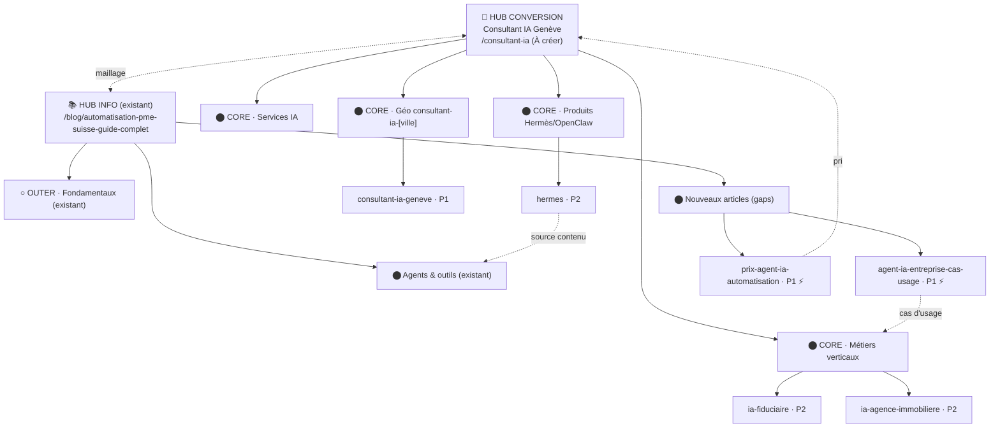

# Topical Map : Consultant IA / Agents IA / Automatisation IA

> Généré le 2026-06-30. Cluster de **30 entrées** : 13 existants (blog), 17 à créer (pages + articles).
> Marché : Genève + Suisse romande (Lausanne, Nyon, Fribourg, Neuchâtel, Sion, Riviera). Audience : dirigeants TPE/PME romandes.
> Source de vérité : ce fichier. Roadmap d'exécution : `docs/planSEOIA.md`.
> Contexte concurrentiel : riposte à **hgnn.io** (Gauthier Huguenin) qui occupe déjà "consultant IA Genève" en transfrontalier. Différenciant = **ancrage suisse réel + prix CHF transparents + preuves chiffrées**.

## Note de structure — 2 piliers, 1 silo

Ce cluster a **deux piliers** qui se renforcent :
- **Pillar CONVERSION (à créer)** : `/consultant-ia` — hub transactionnel qui possède le keyword "consultant IA Genève" et distribue vers les pages géo / métiers / produit.
- **Pillar INFORMATIONNEL (existant)** : `/blog/automatisation-pme-suisse-guide-complet` — déjà le hub éditorial du silo automatisation, alimente l'autorité et remonte vers le hub conversion.

Le blog IA (13 articles) est **déjà construit** : il sert de Outer Section (autorité/trust). Le chantier porte sur la **couche conversion manquante** (Core : hub + géo + métiers + produit) + quelques articles informationnels qui captent les requêtes "agent IA entreprise / consultant IA".

---

## Hiérarchie thématique

### Pillar CONVERSION : Consultant IA à Genève — /consultant-ia *(À créer)*
Keyword : consultant IA Genève / consultant intelligence artificielle Suisse romande | Intent : Commercial/Transactionnel | Statut : **À créer (P1)**

#### Cluster A — Pages service IA — **Core**
- `services/automatisation` — Automatisation & agents IA entreprise **Existant** (retitré 2026-06-30)
- `services/integration-outils` — Connexion d'outils & intégrations **Existant**
- `services/outils-sur-mesure` — Applications/dashboards sur mesure **Existant**
- `services/agent-ia-sur-mesure` — Agent IA sur-mesure (conception, déploiement) **À créer** ⚡
- `services/formation-ia-equipe` — Formation IA pour équipes **À créer**
- `services/audit-ia` — Audit & feuille de route IA **À créer**

#### Cluster B — Pages géo "consultant IA [ville]" — **Core**
- `consultant-ia-geneve` **À créer (P1 — défensif vs hgnn)**
- `consultant-ia-lausanne` **À créer (P2)**
- `consultant-ia-nyon` **À créer (P3)**
- `consultant-ia-fribourg` / `-neuchatel` / `-sion` / `-riviera` **À créer (P4, vague 2)**

#### Cluster C — Pages Métiers verticales — **Core**
- `metiers/ia-fiduciaire` — IA pour fiduciaires & experts-comptables romands **À créer (P2)** ⚡
- `metiers/ia-agence-immobiliere` — IA pour agences immobilières romandes **À créer (P2)**
- `metiers/ia-commerce-retail` — IA pour commerces & retail **À créer (P3)**
- `metiers/ia-cabinet` — IA pour cabinets (avocats / médecins / thérapeutes) **À créer (P3)**
- `metiers/ia-agence-web-marketing` — IA pour agences web & marketing **À créer (P4)**

#### Cluster D — Landings produit — **Core**
- `hermes` — Agent Hermès (landing produit + offre) **À créer (P2)** — contenu source : `blog/hermes-agent-ia-pme`
- `openclaw` — Assistant OpenClaw (landing produit + offre) **À créer (P3)** — contenu source : `blog/openclaw-pme-suisse`

### Pillar INFORMATIONNEL : Automatisation PME Suisse — /blog/automatisation-pme-suisse-guide-complet *(Existant)* ⚡
Keyword : automatisation PME suisse | Intent : Informationnel | Statut : **Existant (hub)**

#### Cluster E — Fondamentaux IA & automatisation PME — **Outer (existant)**
- `ia-pragmatique-pme-suisse` — IA pour PME : 5 usages **Existant**
- `temps-perdu-pme-automatisation` — 654 h/an perdues en admin **Existant** ⚡
- `comment-choisir-quoi-automatiser-pme` — Quoi automatiser en premier + ROI **Existant**
- `avantages-limites-automatisation-pme` — Avantages réels & coûts cachés **Existant**
- `automatisation-club-sportif` — Club sportif : au-delà d'Excel **Existant** (Outer secondaire)

#### Cluster F — Agents IA & outils — **Core/Outer (existant)**
- `workflows-vs-agents-ia-pme` — Workflow ou agent IA : lequel choisir **Existant**
- `hermes-agent-ia-pme` — Hermès Agent guide + prix CHF **Existant**
- `openclaw-pme-suisse` — OpenClaw guide + CHF **Existant**
- `notebooklm-guide-complet-2026` — NotebookLM : analyser ses docs **Existant**
- `application-mobile-automatisation-pme` — App mobile + automatisation **Existant (programmé 2026-07-27)**

#### Cluster G — Nouveaux articles informationnels (gaps) — **Core/Outer**
- `agent-ia-entreprise-cas-usage` — Agent IA pour entreprise : 10 cas d'usage concrets **À créer (P1)** ⚡ — capte "agent IA entreprise" (260/mo)
- `prix-agent-ia-automatisation-suisse` — Combien coûte un agent IA / une automatisation ? Prix CHF **À créer (P1)** ⚡ — différenciant transparence vs hgnn
- `consultant-ia-c-est-quoi` — Consultant IA : c'est quoi, quand en engager un **À créer (P2)** — feed du hub
- `ia-nlpd-conformite-suisse` — IA & nLPD : automatiser en conformité en Suisse **À créer (P2)** ⚡ — Outer trust, intraduisible pour un concurrent français
- `rag-documents-pme` — RAG pour PME : interroger ses documents sans halluciner **À créer (P3)** — étend NotebookLM
- `chatbot-vs-agent-ia-support` — Chatbot générique vs agent IA : support client qui marche **À créer (P3)**

---

## Carte visuelle (Mermaid)

> Visuel de lecture uniquement. Pour approfondir un spoke en sous-cluster : `/seo-topical-map "[topic]" --mode deepen`.

---

## Couverture fan-out

- **Reformulation** (consultant IA / expert IA / spécialiste automatisation IA Genève) : `/consultant-ia`, `consultant-ia-geneve`, `consultant-ia-c-est-quoi`
- **Décomposition** (que fait un consultant IA / cas d'usage / par métier / par ville) : Clusters B, C, `agent-ia-entreprise-cas-usage`
- **Comparaison** (workflow vs agent, chatbot vs agent, Hermès vs OpenClaw, agence vs freelance) : `workflows-vs-agents-ia-pme`, `chatbot-vs-agent-ia-support`, landings produit
- **Implication** (coût, conformité nLPD, ROI, par où commencer) : `prix-agent-ia-automatisation-suisse`, `ia-nlpd-conformite-suisse`, `comment-choisir-quoi-automatiser-pme`
- **Trous détectés** : aucun axe vide. Le pari faible est le volume (marché CH petit) — compensé par intent local fort + conversion.

---

## Tableau de production (trié par priorité)

| # | Entrée | Type | Sec. | Statut | Brand | Bus./Compl. | Trafic | Score | ⚡ | Slug |
|---|---|---|---|---|---|---|---|---|---|---|
| 1 | Consultant IA à Genève (hub) | pillar | Core | À créer | 3 | 3 | 1 | 7 | | `consultant-ia` |
| 2 | Consultant IA Genève (géo) | page | Core | À créer | 3 | 3 | 1 | 7 | | `consultant-ia-geneve` |
| 3 | Agent IA entreprise : 10 cas d'usage | article | Core | À créer | 3 | 2 | 2 | 7 | ⚡ | `agent-ia-entreprise-cas-usage` |
| 4 | Prix agent IA / automatisation (CHF) | article | Core | À créer | 3 | 3 | 1 | 7 | ⚡ | `prix-agent-ia-automatisation-suisse` |
| 5 | Agent IA sur-mesure (service) | page | Core | À créer | 3 | 3 | 1 | 7 | ⚡ | `services/agent-ia-sur-mesure` |
| 6 | IA pour fiduciaires romands | page | Core | À créer | 3 | 3 | 0 | 6 | ⚡ | `metiers/ia-fiduciaire` |
| 7 | IA pour agences immobilières | page | Core | À créer | 2 | 3 | 1 | 6 | | `metiers/ia-agence-immobiliere` |
| 8 | Landing Hermès | page | Core | À créer | 3 | 2 | 1 | 6 | | `hermes` |
| 9 | IA & nLPD : conformité Suisse | article | Outer | À créer | 3 | 1 | 1 | 5+C | ⚡ | `ia-nlpd-conformite-suisse` |
| 10 | Consultant IA Lausanne (géo) | page | Core | À créer | 2 | 2 | 1 | 5 | | `consultant-ia-lausanne` |
| 11 | Consultant IA : c'est quoi | article | Core | À créer | 2 | 2 | 1 | 5 | | `consultant-ia-c-est-quoi` |
| 12 | Formation IA équipe (service) | page | Core | À créer | 2 | 2 | 1 | 5 | | `services/formation-ia-equipe` |
| 13 | Landing OpenClaw | page | Core | À créer | 3 | 1 | 1 | 5 | | `openclaw` |
| 14 | IA pour commerces & retail | page | Core | À créer | 2 | 2 | 1 | 5 | | `metiers/ia-commerce-retail` |
| 15 | Audit & feuille de route IA (service) | page | Core | À créer | 2 | 2 | 0 | 4 | | `services/audit-ia` |
| 16 | RAG pour PME (documents) | article | Outer | À créer | 2 | 1 | 1 | 4+C | | `rag-documents-pme` |
| 17 | Chatbot vs agent IA support | article | Core | À créer | 2 | 1 | 1 | 4 | | `chatbot-vs-agent-ia-support` |
| 18 | IA pour cabinets (avocats/médecins) | page | Core | À créer | 2 | 2 | 0 | 4 | | `metiers/ia-cabinet` |
| 19 | Consultant IA Nyon (géo) | page | Core | À créer | 2 | 1 | 0 | 3 | | `consultant-ia-nyon` |
| — | Géo vague 2 (Fribourg/Neuchâtel/Sion/Riviera) | page | Core | Backlog | 1-2 | 1 | 0 | <3 | | `consultant-ia-{ville}` |
| — | IA agence web/marketing | page | Core | Backlog | 1 | 2 | 0 | 3 | | `metiers/ia-agence-web-marketing` |
| E-F | 13 articles blog IA existants | article | Outer | **Existant** | 3 | 1-2 | 1 | — | | (voir clusters E/F) |

---

## Intent Layering

- **Informationnel** : 13 existants + 5 nouveaux articles ≈ **60 %** (clusters E, F, G) — bon socle GEO/citations IA.
- **Commercial** : cas d'usage, comparatifs, prix, métiers ≈ **25 %**.
- **Transactionnel** : hub + géo + services + landings produit ≈ **15 %**.
- **Analyse** : équilibre sain. La couche informationnelle existe DÉJÀ — le chantier rééquilibre vers la conversion (Core) qui manquait. ⚠️ Ne pas sur-créer d'informationnel : prioriser les pages Core (hub/géo/métiers) qui convertissent.

---

## Blueprint de maillage interne

| Article / Page | Liens sortants obligatoires | Liens sortants recommandés | Liens entrants attendus |
|---|---|---|---|
| `/consultant-ia` (hub) | toutes pages géo + métiers + services IA + landings | hub info blog, articles G | toutes les pages du silo + footer + /services |
| `consultant-ia-geneve` | `/consultant-ia`, `services/automatisation` | métiers, landings produit, `prix-agent-ia-...` | hub, footer, articles G, métiers |
| `metiers/ia-fiduciaire` | `/consultant-ia`, `services/automatisation` | `ia-nlpd-conformite-suisse`, `agent-ia-entreprise-cas-usage` | hub, `consultant-ia-geneve` |
| `hermes` (landing) | `/consultant-ia`, `blog/hermes-agent-ia-pme` | `openclaw`, `workflows-vs-agents-ia-pme` | hub, blog Hermès, articles agents |
| `agent-ia-entreprise-cas-usage` | `blog/automatisation-pme-suisse-guide-complet` | `/consultant-ia`, métiers, `prix-agent-ia-...` | hub info, hub conversion |
| `prix-agent-ia-automatisation-suisse` | hub info | `/consultant-ia`, landings | hub conversion, géo, métiers |
| Blog IA existant (E/F) | (déjà maillé vers hub info) | **ajouter lien montant vers `/consultant-ia`** | hub info |

> Action de maillage transverse : une fois le hub `/consultant-ia` en ligne, **ajouter un lien montant** depuis les 13 articles IA existants (CTA contextuel ou section ressources) vers le hub conversion. C'est ce qui transforme le blog mûr en moteur de leads.

---

## Mini-briefs — articles à créer (informationnels prioritaires)

> Les **pages** (hub, géo, métiers, landings) sont spécifiées dans `docs/planSEOIA.md`. Ci-dessous les **articles blog** à produire via `/seo-brief`.

### 1. Agent IA pour entreprise : 10 cas d'usage concrets (PME romande)
- Slug : `agent-ia-entreprise-cas-usage`
- Type : article (spoke) · Section : Core
- Keyword principal : agent IA entreprise
- Sous-requêtes fan-out : que fait un agent IA en entreprise, exemples concrets, par service (vente/admin/support), agent IA vs automatisation
- Intent : Commercial · Score 7/9 ⚡ (info-gain : cas clients romands réels)
- Word count : 1 600-2 000 · Lien obligatoire → `blog/automatisation-pme-suisse-guide-complet` · Reco → `/consultant-ia`, métiers
- Produire avec : `/seo-brief agent-ia-entreprise-cas-usage`

### 2. Combien coûte un agent IA / une automatisation ? (prix CHF)
- Slug : `prix-agent-ia-automatisation-suisse`
- Type : article · Section : Core
- Keyword principal : prix agent IA / coût automatisation entreprise
- Sous-requêtes : combien coûte une automatisation, prix agent IA sur mesure, ROI, forfait vs régie
- Intent : Commercial · Score 7/9 ⚡ (transparence CHF = différenciant direct vs hgnn qui cache ses prix)
- Word count : 1 400-1 800 · Lien obligatoire → hub info · Reco → `/consultant-ia`, landings
- Produire avec : `/seo-brief prix-agent-ia-automatisation-suisse`

### 3. IA & nLPD : automatiser en conformité en Suisse
- Slug : `ia-nlpd-conformite-suisse`
- Type : article · Section : Outer (trust)
- Keyword principal : IA nLPD entreprise suisse / IA protection des données Suisse
- Sous-requêtes : IA et données personnelles Suisse, agents IA conformité nLPD, hébergement données suisse/europe, IA souveraine PME
- Intent : Informationnel · Score 5/9 + Complétude ⚡ (angle suisse qu'un concurrent FR ne peut pas tenir)
- Word count : 1 400-1 800 · Lien obligatoire → hub info · Reco → `metiers/ia-fiduciaire`, `metiers/ia-cabinet`
- Produire avec : `/seo-brief ia-nlpd-conformite-suisse`

### 4. Consultant IA : c'est quoi et quand en engager un
- Slug : `consultant-ia-c-est-quoi`
- Type : article · Section : Core
- Keyword principal : consultant IA c'est quoi / rôle consultant intelligence artificielle
- Sous-requêtes : que fait un consultant IA, freelance vs agence IA, quand engager, combien ça coûte
- Intent : Informationnel · Score 5/9 · Word count : 1 200-1 500
- Lien obligatoire → `/consultant-ia` · Reco → `prix-agent-ia-automatisation-suisse`
- Produire avec : `/seo-brief consultant-ia-c-est-quoi`

### 5. RAG pour PME : interroger ses documents sans halluciner
- Slug : `rag-documents-pme`
- Type : article · Section : Outer
- Keyword principal : RAG entreprise / IA interroger documents
- Sous-requêtes : RAG c'est quoi, IA sur ses propres documents, base de connaissance IA PME, vs NotebookLM
- Intent : Informationnel · Score 4/9 + Complétude · Word count : 1 400-1 800
- Lien obligatoire → `blog/notebooklm-guide-complet-2026` · Reco → `/consultant-ia`
- Produire avec : `/seo-brief rag-documents-pme`

### 6. Chatbot générique vs agent IA : le support client qui marche
- Slug : `chatbot-vs-agent-ia-support`
- Type : article · Section : Core
- Keyword principal : chatbot vs agent IA / chatbot support client IA
- Sous-requêtes : différence chatbot et agent IA, agent IA support client, chatbot connecté aux outils
- Intent : Commercial · Score 4/9 · Word count : 1 200-1 600
- Lien obligatoire → `blog/workflows-vs-agents-ia-pme` · Reco → `services/agent-ia-sur-mesure`
- Produire avec : `/seo-brief chatbot-vs-agent-ia-support`

---

## Cannibalisation détectée / à surveiller

- `services/automatisation` (retitré "Automatisation & agents IA entreprise") vs futur `services/agent-ia-sur-mesure` : **risque réel**. Résolution → `automatisation` reste la page large (tâches + workflows + agents) ; `agent-ia-sur-mesure` se concentre sur la **conception d'agents autonomes spécifiques** (intent plus pointu). Titles franchement distincts. Sinon, faire de `agent-ia-sur-mesure` une **section** du hub plutôt qu'une page.
- `/consultant-ia` (hub) vs `consultant-ia-geneve` (géo) : OK si le hub est **positionnement/offre générale Suisse romande** et la page géo est **locale Genève** (preuves locales, FAQ déplacement, LocalBusiness). Ne pas dupliquer le corps.
- Pages géo entre elles : risque de duplication template. Résolution → contenu local réel par ville (zones, secteurs dominants, références), pas un template avec le nom remplacé (cf. règle programmatic-seo).
- `blog/hermes-agent-ia-pme` (article) vs `hermes` (landing) : intents différents (informationnel vs transactionnel). La landing cible "agent Hermès déploiement/offre", l'article cible "Hermès c'est quoi". Maillage croisé, pas de cannibalisation si titles distincts.
